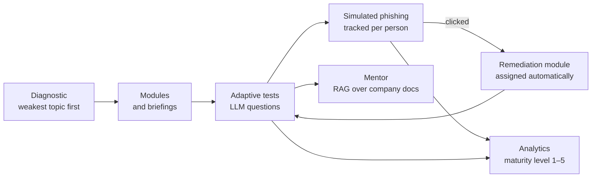

# VKR — Security Awareness Platform

**Graduation thesis prototype: a web application that trains employees in information security and checks whether the training changed their behaviour — not only their test scores.**

<sub>Веб-приложение для повышения осведомлённости сотрудников в области информационной безопасности.</sub>

---

Most awareness programmes stop at a quiz: people learn the answers, and nothing changes the next time a convincing email arrives. This prototype closes the loop — it teaches, tests, then sends a simulated phishing campaign and uses what people actually did to decide what they learn next.



## What's in it

| | |
|---|---|
| **Adaptive diagnostic** | Five topics — phishing, passwords, personal data, incident response, social engineering. Each next question targets the weakest topic; topics below 50% get matching modules assigned. |
| **LLM testing** | GPT-4o writes multiple-choice questions from the module content across eight categories (scenario, threat recognition, policy, …), validated by a strict schema; a wrong answer gets an explanation grounded in the company's documents. |
| **AI mentor (RAG)** | Documents are chunked (500 words, 50 overlap), embedded with `text-embedding-3-small`, searched with pgvector (cosine, ivfflat); answers cite their sources. |
| **Prompt-injection guard** | Every text that reaches the model — user input, module text, retrieved chunks, chat history — is length-capped and stripped of role tags and injection patterns. |
| **Phishing simulation** | Campaigns with per-recipient tracking (opened, clicked, submitted, reported). Credentials are never stored; a click assigns a remediation module. Delivery is in-app by design. |
| **Social-engineering roleplay** | An LLM plays the attacker in three scenarios; the employee has to recognise the pretext. |
| **Maturity model** | Five levels, from compliance-driven to metrics-driven, computed from eight indicators: completion, scores, click, submit and report rates. |
| **Compliance** | Built around 152-FZ, 187-FZ and FSTEC Order No. 21: append-only audit log written in the same transaction, CSV export, briefing types, training schedules; no personal data sent to the LLM. |
| **Access** | Four roles (employee, manager, security specialist, admin), JWT with refresh tokens, bcrypt, TOTP two-factor. |

## Stack

**Backend** — Python 3.11 · FastAPI · SQLAlchemy 2 (async) · Alembic · PostgreSQL 16 + pgvector · OpenAI
**Frontend** — React 18 · TypeScript · Vite · Tailwind · TanStack Query · Zustand
**Run** — Docker Compose · 245 backend tests (pytest)

## Run it

```bash
cp .env.example .env          # set OPENAI_API_KEY, SECRET_KEY and a database password
docker compose up -d
docker compose exec backend alembic upgrade head
docker compose exec backend python -m app.seed
```

The seed script creates four demo users (`admin@`, `specialist@`, `manager@`, `employee@vkr.example.com`) with passwords from `SEED_*_PASSWORD`, or prints random ones if those are not set.

Frontend — http://localhost:5173 · API docs — http://localhost:8000/docs

## Limits of the prototype

- Phishing emails are delivered to an in-app inbox, not over SMTP.
- Training schedules run when triggered, not by a background scheduler.
- The vector index is sized for prototype scale.

---

Part of [23AG Research](https://research.23ag.one/).
